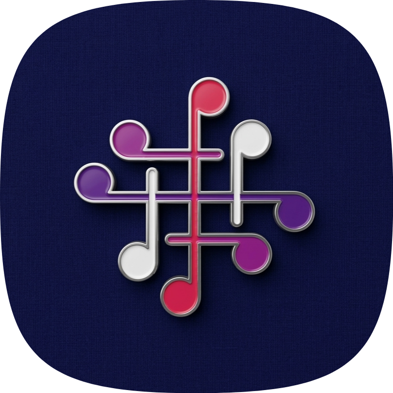
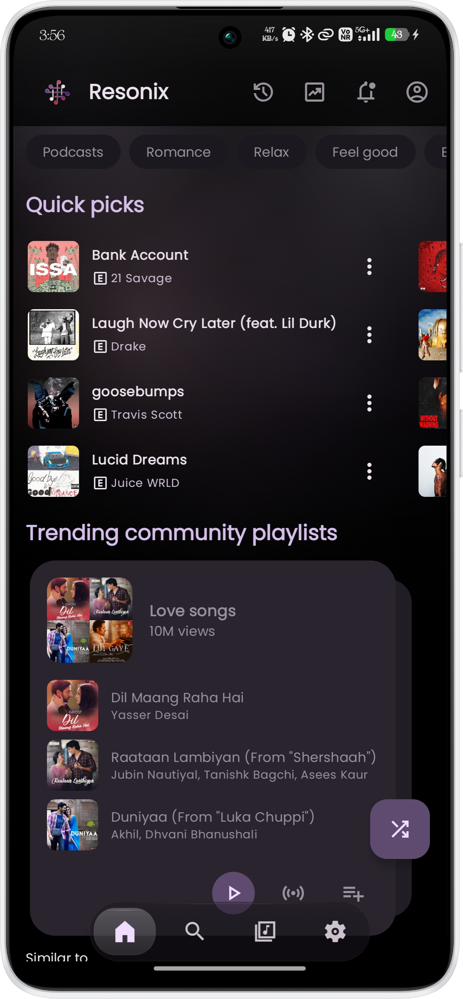
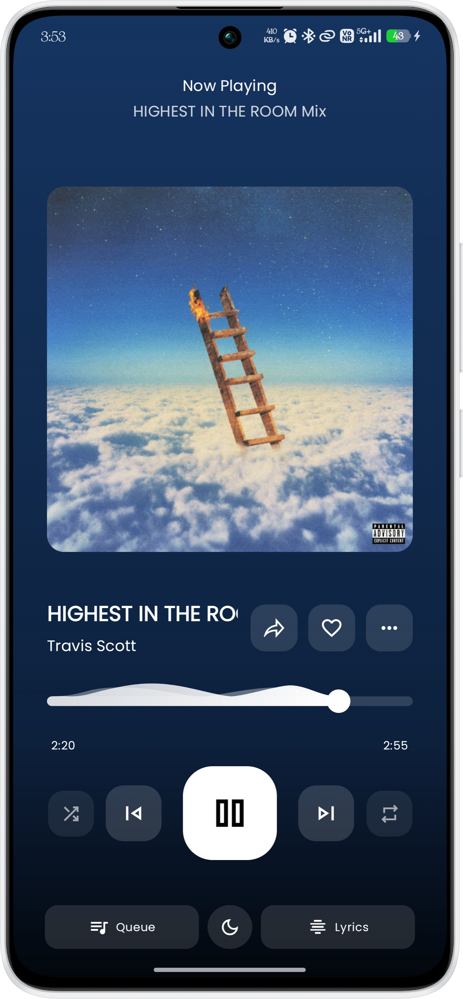
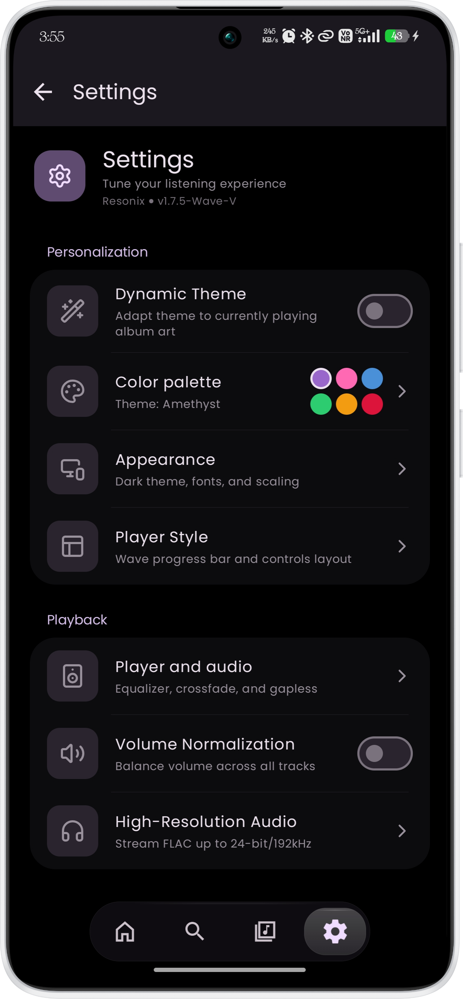
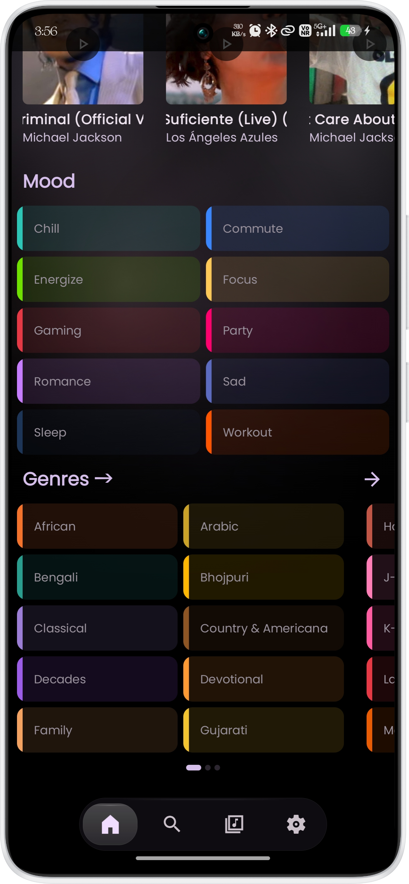
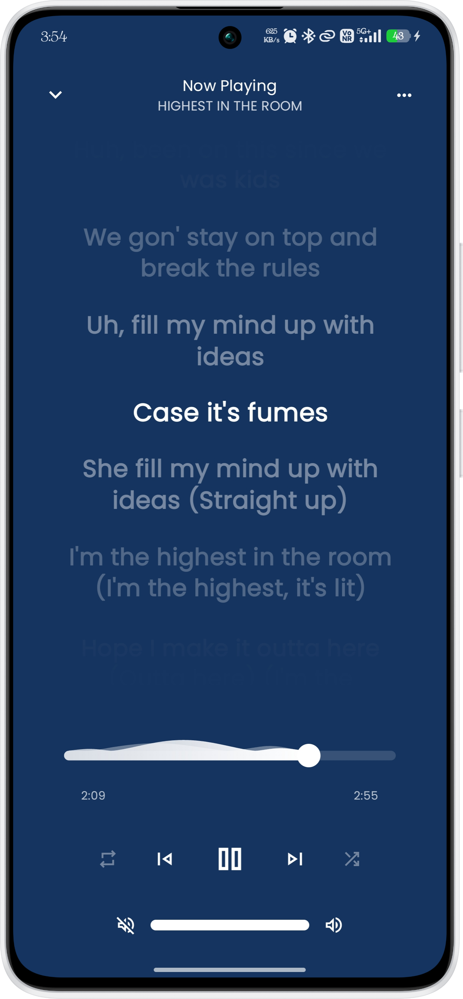
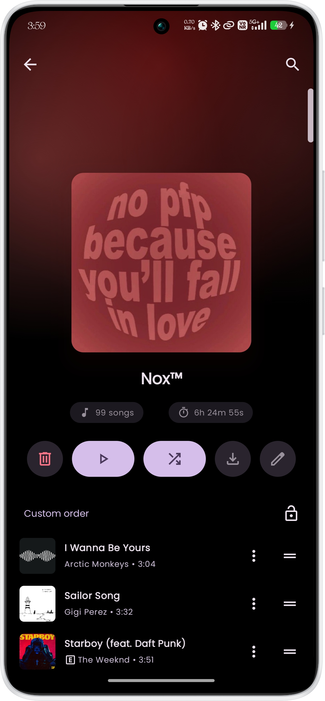
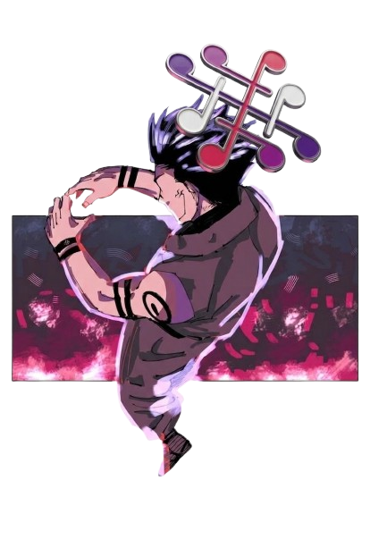

# Resonix

### Your music universe, reimagined for Android.

 

 

 

[**Download**](#download-now) · [**Features**](#features) · [**Showcase**](#showcase) · [**FAQ**](#faq) · [**Support**](#support)

---

# About Resonix

Resonix is built for people who don’t just listen to music, they chase it.

Whether a song is playing in the background of a reel, a café, or a passing car, Resonix helps you **recognize tracks instantly, stream them beautifully, and keep everything in one place**.

From fast music recognition and immersive playback to synced lyrics and smart discovery, Resonix turns curiosity into instant listening.

Built with a modern Android-first design philosophy, the experience is fast, fluid, and elegant.

---

> [!IMPORTANT]
> Resonix is an all-in-one Android music experience focused on intelligent recognition, beautiful playback, and seamless discovery.
>
>If YouTube Music is not available in your region you are recommended to connect a vpn of an available region so the app can function properly.

---

# 📸Showcase

---

# 🪄Features

<h3>Instant Music Recognition</h3> 
  <ul>
  <li>Identify songs in seconds using our integrated native Shazam audio recognition engine.</li>
  <li>Experience a stunning, 3D-simulated Jetpack Compose recognition orb with responsive audio-visual pulsing.</li>
  <li>Access a full recognition history log to easily revisit, stream, or download previously discovered tracks.</li>
  <li>Benefit from rapid fallback matching and optimized audio chunk encoding for accurate results.</li>
  </ul>

<h3>Advanced Synced Lyrics</h3>
  <ul>
  <li>Enjoy real-time synchronized lyrics sourced from multiple backends including LRCLIB, LyricsPlus, and SimpMusic.</li>
  <li>Prioritize your preferred lyrics source with a smart, priority-based provider fallback system.</li>
  <li>Access comprehensive romanization and AI-powered text translation right inside the player UI.</li>
  <li>Customize the lyrics experience directly from a unified Material 3 settings interface.</li>
  </ul>

<h3>Immersive Modern Interface</h3>
  <ul>
  <li>Navigate through a beautifully crafted Material 3 design featuring dynamic system-wide theming.</li>
  <li>Interact with a modern music player sporting rich animations, immersive cover artwork, and intuitive gestures.</li>
  <li>Enjoy consistent, unified aesthetics across settings screens, bottom sheets, and playback states.</li>
  <li>Experience fluid, lag-free transitions built entirely from the ground up using native Android Jetpack Compose.</li>
  </ul>

<h3>Powerful Playback & Downloads</h3>
  <ul>
  <li>Stream music in high-quality audio with an optimized engine built to handle seamless background tasks, so your music doesn't die on you.</li>
  <li>Powerful audio normalization across the whole app like nothing happened with the volume spikes.</li>
  <li>Download your favorite tracks natively using built-in yt-dlp integrations without needing external tools.</li>
  <li>Extract and convert audio instantly from supported social media and video links into local offline files.</li>
  <li>Take complete control of your active listening queue with intelligent playlist management features.</li>
  <li>Built to keep music flowing even when networks behave like they were designed by gremlins.</li>
  </ul>

<h3>Smart Search & Discovery</h3>
  <ul>
  <li>Search instantly across massive catalogs for specific tracks, featured artists, albums, and curated playlists.</li>
  <li>Discover new music through personalized recommendations and explore trending picks tailored to your local region.</li>
  <li>Rely on refined search navigation flows that remove accidental interactions and prioritize your content.</li>
  <li>Seamlessly transition from a recognized song directly to the artist's full discography and top hits.</li>
  </ul>

 <h3>Modern Player UI</h3> 
  <ul>
  <li>Many player UI options to choose from, choose the one that matches your aesthetic.</li>
  <li>Upto five progress bar styles to choose from, choose your own vibe.</li>
  <li>One UI 6 inspired waveform progress bar with double sine wave for precision animation.</li>
  <li>Newly added Waveform Bar progress bar for a more immersive experience.</li>
  <li>Every interaction is designed to feel premium, responsive, and distinctly Android-native.</li>
  </ul> 

---

<h1>Download Now</h1>

<table>
  <tr>
    <th align="center">Obtainium</th>
    <th align="center">OpenAPK</th>
  </tr>
  <tr>
    <td align="center">
      
    </td>
    <td align="center">
      
    </td>
  </tr>

  <tr>
    <th align="center" colspan="2">GitHub</th>
  </tr>
  <tr>
    <td align="center" colspan="2">
      
    </td>
  </tr>
</table>

---

# ❓FAQ

### Is Resonix free?
Yes, fully free and open-source.

### Is it under active development?
Constantly.

---

<h1>🫱🏻‍🫲🏻Acknowledgements</h1>
 
<table>
  <thead>
    <tr>
      <th align="center">Project</th>
      <th align="center">Contribution</th>
    </tr>
  </thead>
  <tbody>
    <tr>
      <td><a href="https://github.com/MetrolistGroup/Metrolist"><strong>Metrolist</strong></a></td>
      <td>For the base Framework and Design</td> 
    </tr>
    <tr>
      <td><a href="https://github.com/koiverse/ArchiveTune"><strong>ArchiveTune</strong></a></td>
      <td>For UI Inspirations</td> 
    </tr>
    <tr>
      <td><a href="https://github.com/dead8309/Kizzy"><strong>Kizzy</strong></a></td>
      <td>Discord Rich Presence implementation & inspiration</td>
    </tr>
    <tr>
      <td><a href="https://better-lyrics.boidu.dev"><strong>Better Lyrics</strong></a></td>
      <td>Time-synced lyrics with word-by-word highlighting & YouTube Music integration</td>
    </tr>
    <tr>
      <td><a href="https://github.com/maxrave-dev/SimpMusic"><strong>SimpMusic Lyrics</strong></a></td>
      <td>Lyrics data via the SimpMusic Lyrics API</td>
    </tr>
    <tr>
      <td><a href="https://github.com/aleksey-saenko/MusicRecognizer"><strong>MusicRecognizer</strong></a></td>
      <td>Music recognition feature & Shazam API integration</td>
    </tr>
  </tbody>
</table>

<h3>We also thank the entire open-source community! Every library, tool, and API that powers this project!</h3>

---

# 🫀Support

**If you enjoy Resonix, consider starring the repository and joining the <a href="https://t.me/resonix_music_app">community.**</a>

**Built with unreasonable ambition by <a href="https://github.com/Nox-Wizard-py">Nox Wizard**</a>

---

<h1>⚖️Disclaimer</h1>

Resonix is an independent open-source project and is <strong>not affiliated with, endorsed by, sponsored by, or officially associated</strong> with any music streaming platform, content provider, or their respective parent companies.

All trademarks, logos, brand names, and service marks mentioned or referenced within this project remain the property of their respective owners.

Resonix does not claim ownership over any third-party content, metadata, or streaming sources accessed through the application.

This software is provided for educational, research, and personal use purposes only.

---

  <h1>🏳️Stand for Android Freedom</h1>

  

    Android was built on the promise of openness, freedom, and innovation.
    Developers and users alike deserve the right to build, customize, distribute,
    and use applications without unnecessary restrictions or ecosystem lockdowns.
  

  

    We stand with the open Android community and support efforts to preserve
    user choice, sideloading, open-source development, and developer freedom.
    Join the movement and help keep Android open for everyone.
  

   

  <a href="https://keepandroidopen.org" target="_blank"
     style="text-decoration: none; padding: 12px 24px; border-radius: 10px; border: 1px solid rgba(255,255,255,0.2); font-weight: 600;">
    KeepAndroidOpen
  </a>

---

<h4>Everyone has the right to be free. 🏳️</h4>

---

---

<h4>Built with ❤️ by <a href="https://t.me/offxe_shoyo">Nox Wizard</a></h4>

